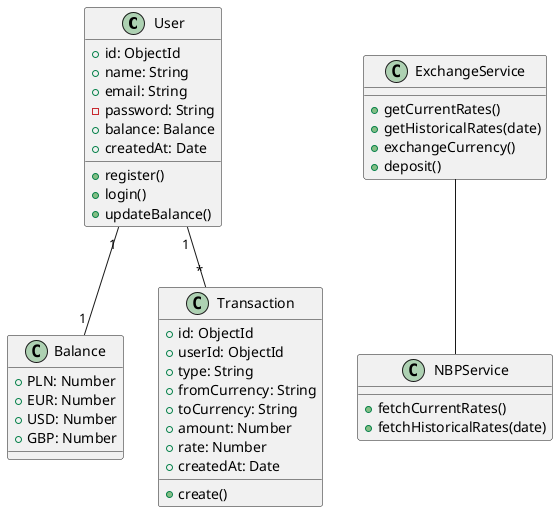

# Currency Exchange App - Class Diagram

```plantuml
@startuml
class User {
  +id: ObjectId
  +name: String
  +email: String
  -password: String
  +balance: Balance
  +createdAt: Date
  +register()
  +login()
  +updateBalance()
}

class Balance {
  +PLN: Number
  +EUR: Number
  +USD: Number
  +GBP: Number
}

class Transaction {
  +id: ObjectId
  +userId: ObjectId
  +type: String
  +fromCurrency: String
  +toCurrency: String
  +amount: Number
  +rate: Number
  +createdAt: Date
  +create()
}

class ExchangeService {
  +getCurrentRates()
  +getHistoricalRates(date)
  +exchangeCurrency()
  +deposit()
}

class NBPService {
  +fetchCurrentRates()
  +fetchHistoricalRates(date)
}

User "1" -- "1" Balance
User "1" -- "*" Transaction
ExchangeService -- NBPService
@enduml
```
