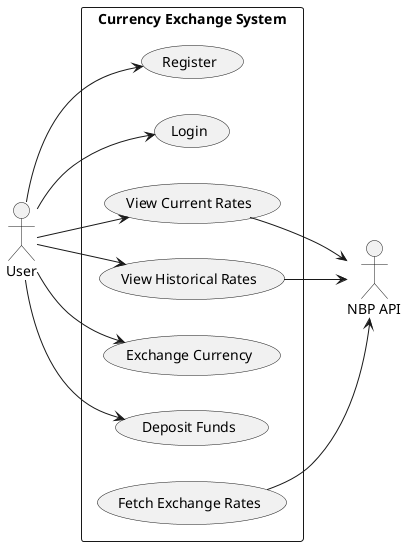

# Currency Exchange App - Use Case Diagram

```plantuml
@startuml
left to right direction
actor "User" as user
actor "NBP API" as nbp

rectangle "Currency Exchange System" {
  usecase "Register" as UC1
  usecase "Login" as UC2
  usecase "View Current Rates" as UC3
  usecase "View Historical Rates" as UC4
  usecase "Exchange Currency" as UC5
  usecase "Deposit Funds" as UC6
  usecase "Fetch Exchange Rates" as UC7
}

user --> UC1
user --> UC2
user --> UC3
user --> UC4
user --> UC5
user --> UC6
UC3 --> nbp
UC4 --> nbp
UC7 --> nbp
@enduml
```
